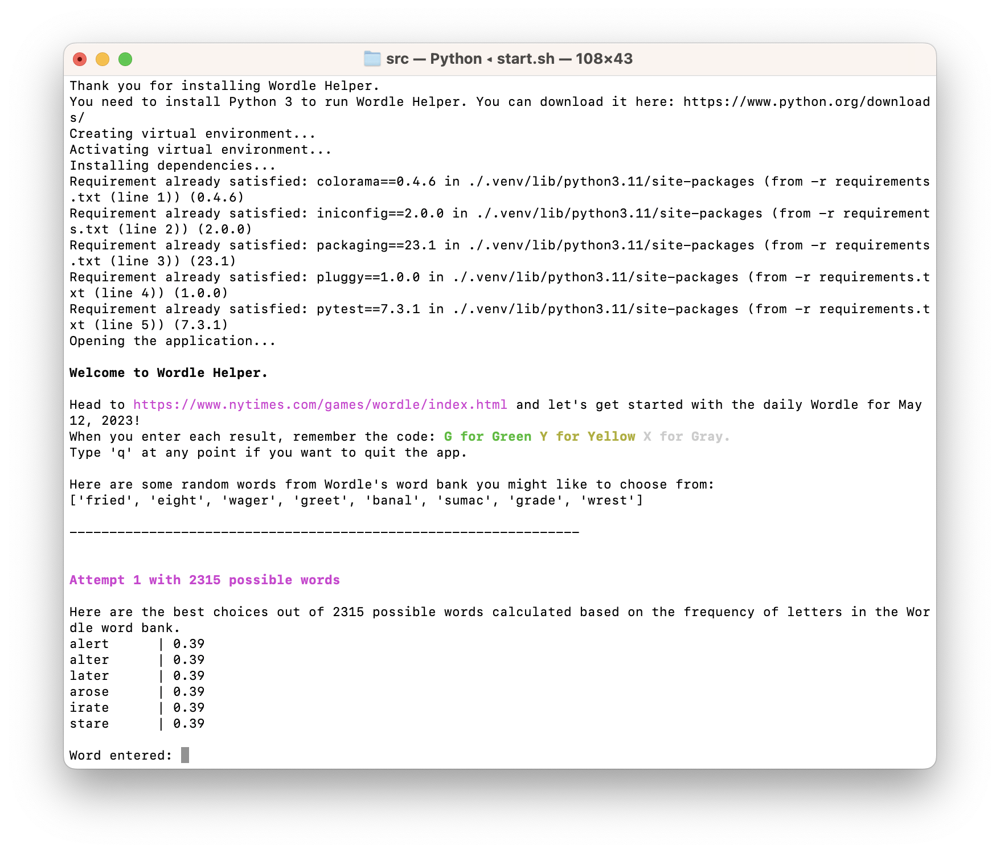
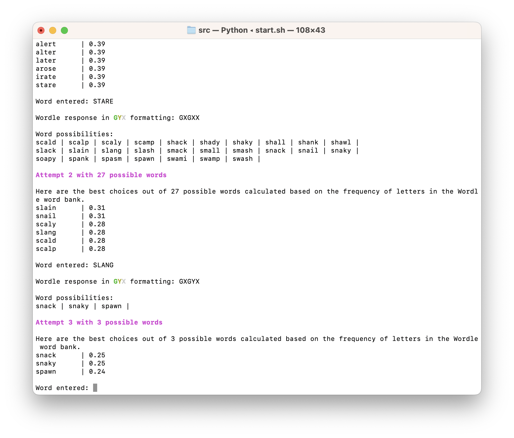
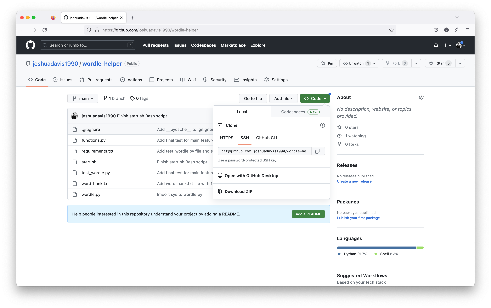
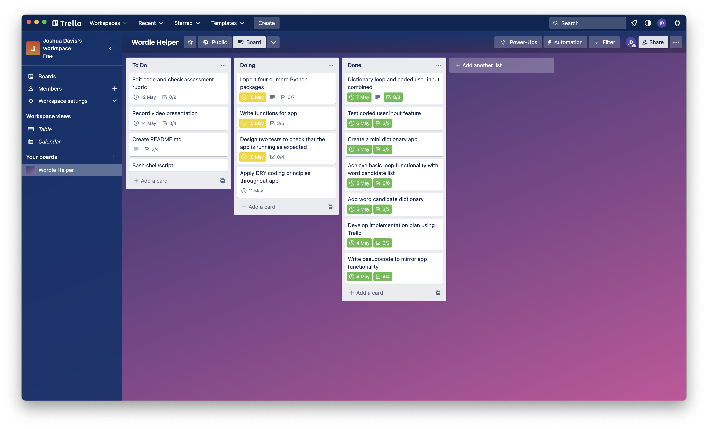
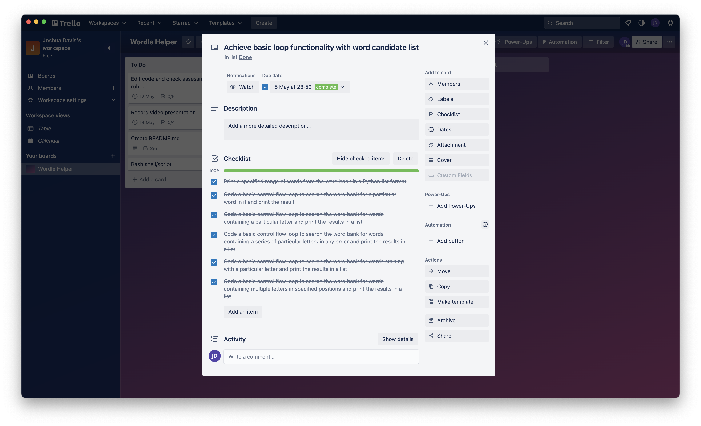
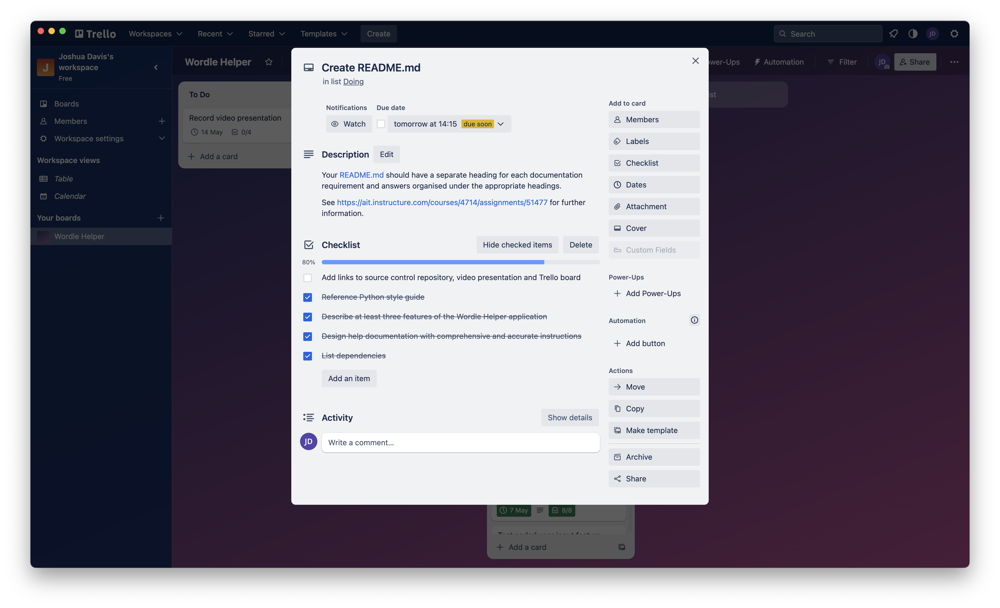

# T1A3 Terminal Application

**Name:** Joshua Davis

**Student Number:** 14209

| Assessment Component | Link |
| --- | --- |
| GitHub repository | https://github.com/joshuadavis1990/wordle-helper |
| Video presentation link | https://youtu.be/RCo6lQNxriI |
| Trello link | https://trello.com/b/jSdMjDvb/wordle-helper |

## Features of *Wordle Helper*

*Wordle Helper* is an intelligent command line application designed with the following main features in mind.

| Main Feature | Description |
| --- | --- |
| A helpful tool that runs locally alongside the NY Times web app | *Wordle Helper* assists the user in solving *Wordle* puzzles by locally prompting them throughout their six attempts at https://www.nytimes.com/games/wordle/index.html. It loops through six possible attempts, prompting users for various inputs to help them reach the solution in as little attempts as possible. |
| Intelligently searches through 2315 words | *Wordle Helper* dynamically searches through the current *Wordle* dictionary of approximately 2000 5 letter words to narrow down the possible word candidates each day. The app has been programmed to remove possible word candidates as the user provides it information about letter positions and exclusions. |
| Randomises at the start of each game | *Wordle Helper* provides a small list of random words from the *Wordle* dictionary the user may choose to input at the start of the program. |
| Makes it easy to input data | *Wordle Helper* includes an easy coding system for the user to input *Wordle* data: G = Green, Y = Yellow, X = Grey (e.g. XXXYG). If at any point the user enters a letter the program does not recognise, it is able to handle that error gracefully. |
| Deciphers code and acts on it | *Wordle Helper* reads and responds to the symbols in the user's input. It draws a connection between the word entered and the symbols entered, and iterates over each letter through every word in the Wordle dictionary, searching for words that can be ruled out. |
| Helps the user improve their stats | *Wordle Helper* presents the user with, after each of their six possible attempts, a short list of words that contain the most frequent letters used in the *Wordle* word bank. In instances where the user may have hundreds of words to choose from, this helps them choose the most likely candidate based on letter use frequency. However, the application is quick to narrow down word candidates after each round! |

Here are some screnshots of the application running a Bash script in the macOS terminal.




## Help Documentation

*Wordle Helper* is a simple application with intelligent capabilities. It is designed to run alongside your six attempts on the official *Wordle* site, prompting you with possible word ideas that may increase your stats! All you need to do is:

1. Head to the official *Wordle* game at https://www.nytimes.com/games/wordle/index.html
1. Run *Wordle Helper* using the instructions below.
1. Choose your first word from a pre-selected list of words in the *Wordle* dictionary that contain the most common letters, or just stick with your own favourite starting word!
1. Enter your result from *Wordle* in an easy to remember format: G for Green, Y for Yellow and X for Gray.
1. The application will then narrow down the *Wordle* dictionary and present you with a new list of possible words.
1. Repeat the above process for your six attempts!

You can type q at any point to quit the application.

*Wordle Helper* has built-in error handling. If you enter an incorrect character, or anything other than a 5-letter word, you will be asked to re-enter.

## Styling Conventions

*Wordle Helper* uses the *PEP 8 – Style Guide for Python Code* by Guido van Rossum: https://peps.python.org/pep-0008/

## Installation Instructions

*Wordle Helper* is designed to run on Linux and macOS. Windows users can, however, still use the application, but must run it through the Windows Subsystem for Linux (WSL) (Ubuntu).

### Step 1: Check which version of Python you have installed

*Wordle Helper* is written in the Python programming language and requires Python 3. Many operating systems will have this pre-installed, but you can easily check which version you have installed by running one of the following commands in Terminal:

```
python3 --version
```

```
python --version
```

* If you have Python installed, check to make sure it is version 3.11.3 or higher.
* If you do not have Python installed, please visit the following link and complete installation: https://wsvincent.com/install-python/#install-python

### Step 2: Make a new directory on your computer to store the application.

### Step 3: Inside this directory, run the following command to clone the *Wordle Helper* repository from GitHub

```
git clone git@github.com:joshuadavis1990/wordle-helper.git
```

This link was taken from the Github repository as depicted here:



### Step 4: Open the folder by running the following command

```
cd wordle-helper
```

### Step 5: Run the following automated Bash script

```
./start.sh
```

This command will automatically complete the following steps:

1. Check that Python is correctly installed on your machine
1. Create a virtual environment for the application and its dependencies to run within
1. Activate the vitual environment
1. Install all of the application's dependencies
1. Run the application
1. Deactivate the virtual environment when the application is closed

```
#!/bin/bash
echo "Thank you for installing Wordle Helper."
if [[ -x "$(command -v python)" ]]
then
    pyv="$(python -V 2>&1)"
    if [[ $pyv == "Python 3"* ]]
    then
        echo "Check complete. You have the correct version of Python installed."
    else
        echo "Sorry, this version of Python is not supported by Wordle Helper. Please download Python 3 at: https://www.python.org/downloads/" >&2
    fi
else
    echo "You need to install Python 3 to run Wordle Helper. You can download it here: https://www.python.org/downloads/" >&2
fi
echo "Creating virtual environment..."
python3 -m venv .venv
echo "Activating virtual environment..."
source .venv/bin/activate
echo "Installing dependencies..."
pip3 install -r requirements.txt
echo "Opening the application..."
python3 wordle.py
deactivate
```

If you are presented with the error message, `Permission denied`, run the following command:

```
chmod +x my_wrapper.sh
```
## *Wordle Helper* Dependencies

```
colorama==0.4.6
iniconfig==2.0.0
packaging==23.1
pluggy==1.0.0
pytest==7.3.1
```

## Implementation Plan

Trello was used throughout the development of *Wordle Helper* to track the progress of the app's main features. The link to the public board is: https://trello.com/b/jSdMjDvb/wordle-helper



